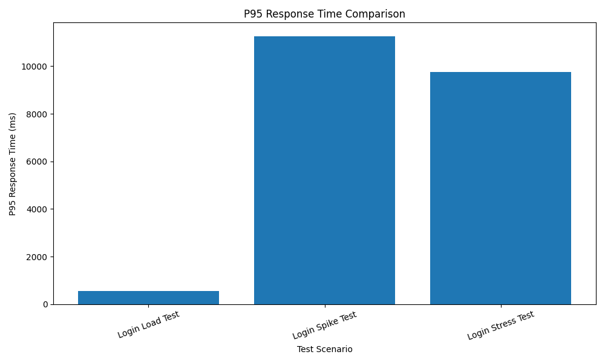
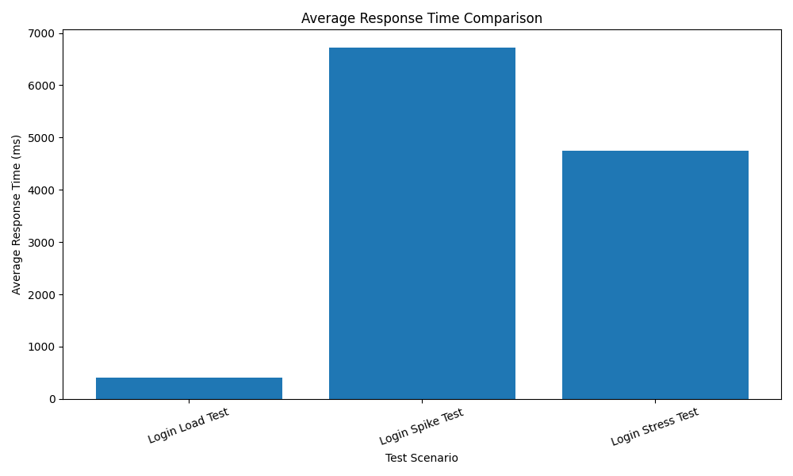
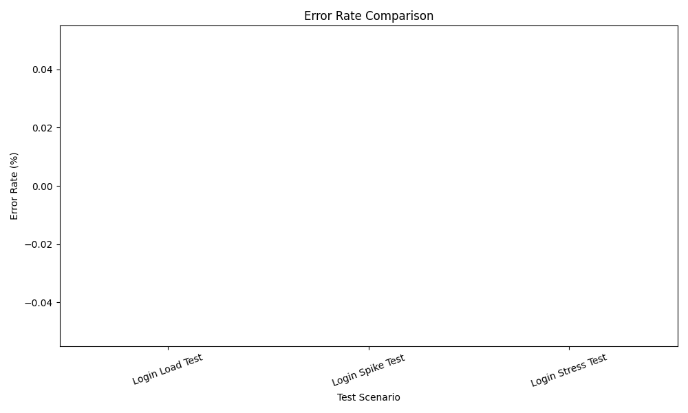
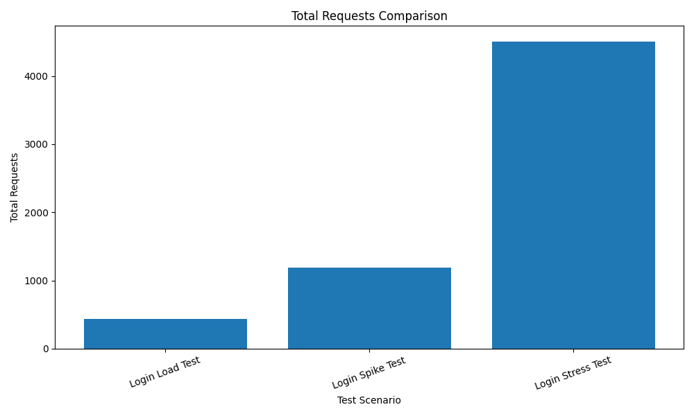

# k6 Performance Test Comparison Report

## Summary Table

| Test Name | P95 Response Time | Average Response Time | Error Rate | Total Requests | Status | Category |
|---|---:|---:|---:|---:|---|---|
| Login Load Test | 566.36 ms | 401.10 ms | 0.00% | 432 | PASS | EXCELLENT |

## Performance Charts

| Login Spike Test | 11267.84 ms | 6727.15 ms | 0.00% | 1187 | FAIL | WARNING |

## Performance Charts

| Login Stress Test | 9754.80 ms | 4744.89 ms | 0.00% | 4509 | FAIL | WARNING |

## Performance Charts

### P95 Response Time

### Average Response Time

### Error Rate

### Total Requests

## Overall Interpretation

Terdapat skenario pengujian yang belum memenuhi threshold, yaitu: Login Spike Test, Login Stress Test. Hal ini menunjukkan bahwa sistem masih perlu dianalisis lebih lanjut, terutama pada aspek latency, kapasitas server, proses backend, dan penggunaan resource saat beban meningkat.